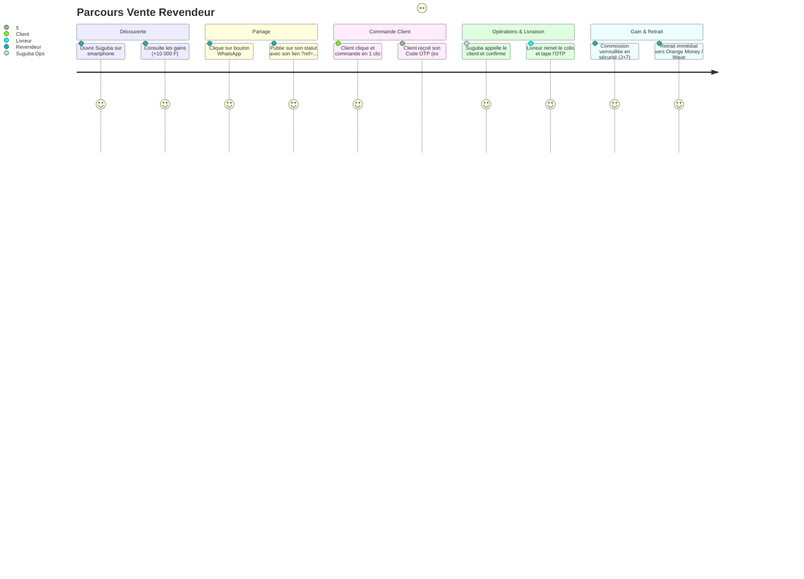

# Parcours Utilisateurs (User Flows) — Suguba SaaS

## Flux 1 : Le Revendeur partage un produit sur WhatsApp et encaisse sa commission



---

## Flux 2 : La Commande Client Directe Express (Zéro friction)

```
Page Produit (/p/smart-tv-samsung-43?ref=MOUSSA123)
  ↓
1. Choisit la quantité
2. Saisit son Nom & Téléphone
3. Saisit son Quartier & Repère Visuel ("En face de la clinique")
4. Clique sur "Confirmer Ma Commande"
  ↓
Page de Confirmation avec Code Secret OTP
(Le client sait exactement combien payer en espèces/Mobile Money à la réception)
```

---

## Flux 3 : La Livraison Terrain & Preuve de Remise par OTP

```
Livreur ouvre /driver sur son smartphone
  ↓
1. Voit l'adresse fournisseur pour récupérer le colis
2. Voit l'adresse client et le repère visuel précis
3. Clique sur "Appeler le client"
4. Arrive sur place et encaisse les 147 000 FCFA
5. Demande au client son Code Secret Suguba (ex: 5832)
6. Tape le code dans la modale OTP
  ↓
Résultat immédiat :
- Commande marquée "LIVRÉ"
- Encaissement validé
- Commission Revendeur verrouillée en période de sécurité anti-retour (J+7)
```
